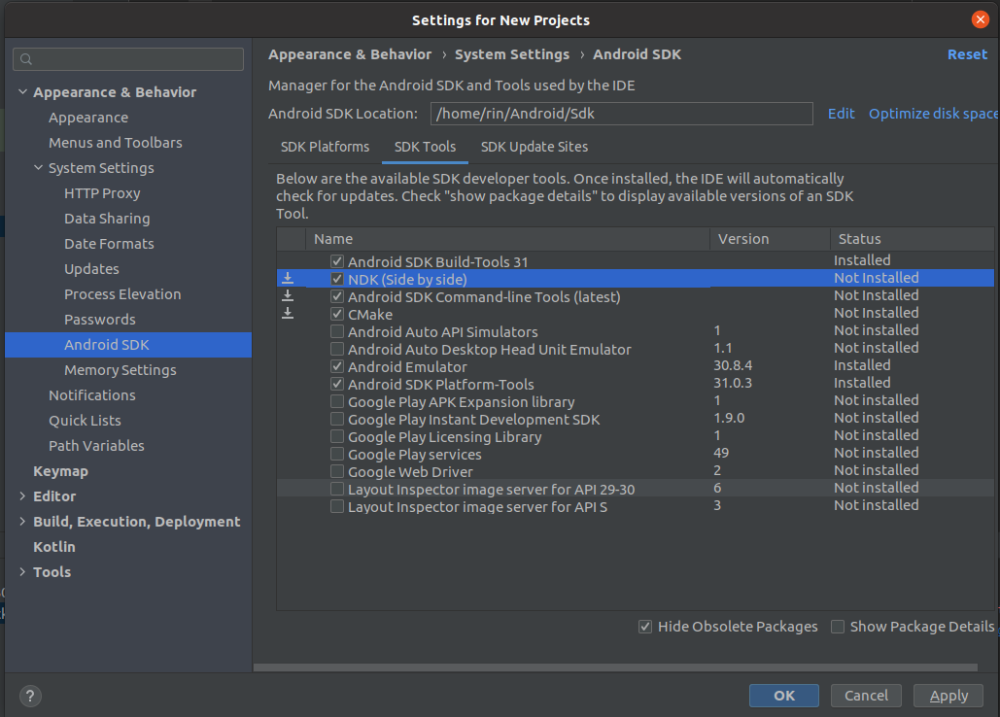

# rust-on-android template
## flow

We'll need toolchain to compile our codes for the android target.
```
$ rustup target add armv7-linux-androideabi  # For 32-bit ARM.
$ rustup target add aarch64-linux-android    # For 64-bit ARM.
```

We'll need [android studio](https://developer.android.com/studio) to manage the interface
of APPs. It also helps to install NDK (Native Development Kit) and its associated tool.
From *Tools -> SDK manager -> SDK tools*, download the following tools:



note: The ndk version over r23 could not work. You should try the older one.
## Reference

* [Building and Deploying a Rust library on Android](https://mozilla.github.io/firefox-browser-architecture/experiments/2017-09-21-rust-on-android.html)
* [Running Rust on Android](https://blog.svgames.pl/article/running-rust-on-android)
* [android-ndk-rs](https://github.com/rust-windowing/android-ndk-rs)
* [rust-on-android](https://github.com/suve/rust-on-android/)
* [cross-platform-rust](https://github.com/fluffyemily/cross-platform-rust)
